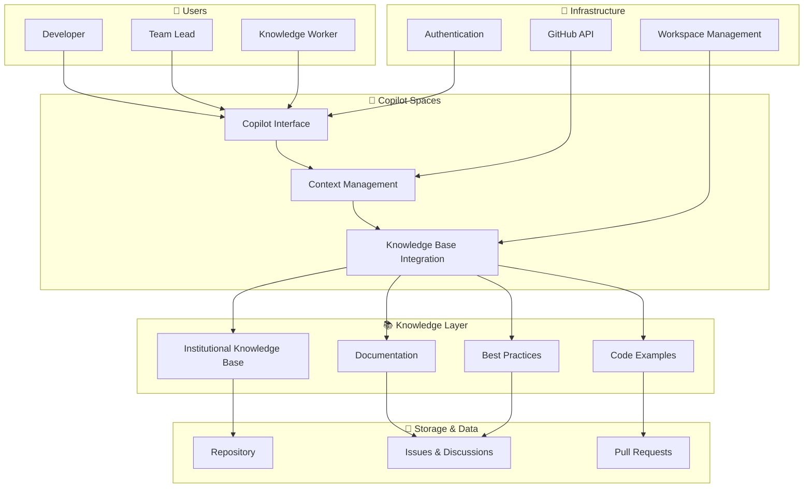

# Architecture Overview

This document provides a visual architecture overview of the Copilot Spaces institutional knowledge scaling exercise.

## System Architecture

## Component Descriptions

### Users
- **Developer**: Uses Copilot Spaces to access code examples and technical documentation
- **Team Lead**: Leverages institutional knowledge for project planning and mentoring
- **Knowledge Worker**: Maintains and updates the knowledge base

### Copilot Spaces
- **Copilot Interface**: Primary interaction point for users
- **Context Management**: Handles context switching and multi-user scenarios
- **Knowledge Base Integration**: Connects user queries with institutional knowledge

### Knowledge Layer
- **Institutional Knowledge Base**: Centralized repository of organizational expertise
- **Documentation**: Comprehensive guides and tutorials
- **Code Examples**: Real-world implementation samples
- **Best Practices**: Established patterns and standards

### Storage & Data
- **Repository**: Source code and configuration files
- **Issues & Discussions**: Q&A and decision records
- **Pull Requests**: Change history and reviews

### Infrastructure
- **GitHub API**: Integration point for data and operations
- **Authentication**: Security and access control
- **Workspace Management**: Multi-user space coordination
